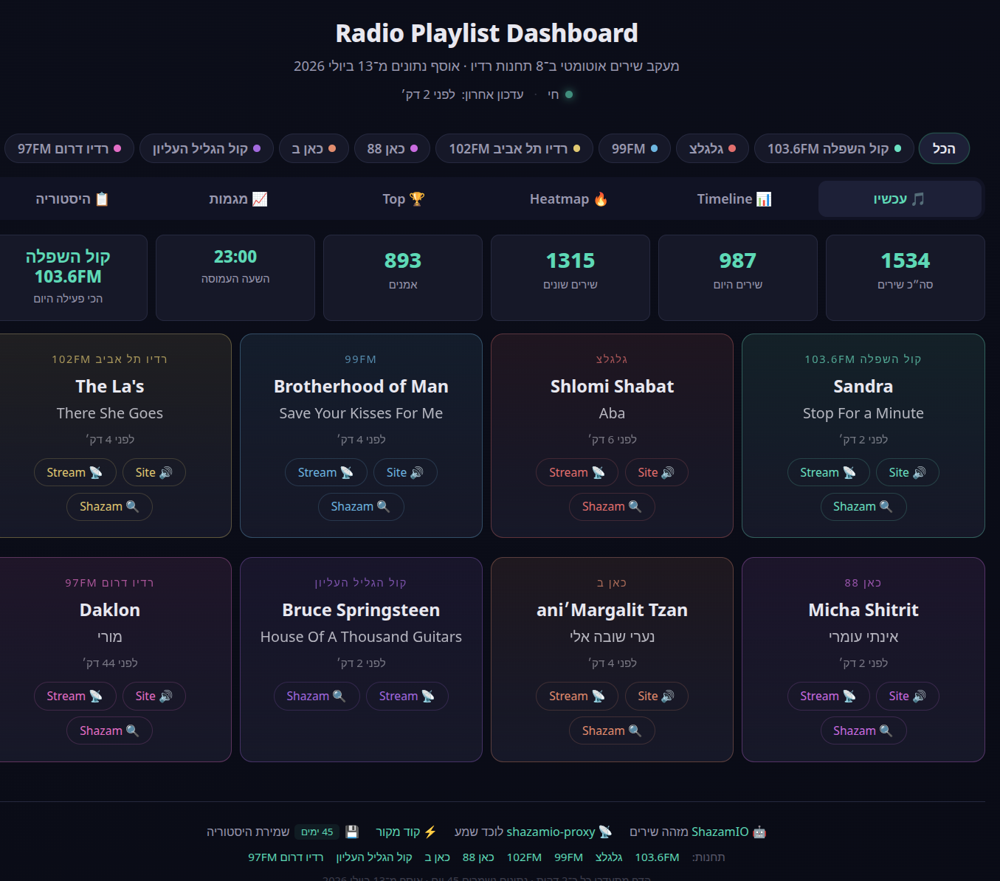

# 🎧 Radio Playlist Dashboard

> **Live at → [brchn6.github.io/radio-playlist-dashboard](https://brchn6.github.io/radio-playlist-dashboard/)**

A live dashboard that recognizes and logs every song playing on Israeli radio — in real time, zero cost, fully automatic.



---

## ✨ What it does

8 radio stations. 8 Shazam proxies. One Postgres source of truth (Supabase) plus a local append-only track mirror. A GitHub Pages dashboard that stays fresh within a minute — collector running on a machine at home, costing **exactly $0/month**.

| 🇮🇱 Stations | 🎵 Songs logged | ⏱️ Dashboard refresh | 💸 Monthly cost |
|---|---|---|---|
| קול השפלה, גלגלצ, 99FM, רדיו תל אביב, כאן 88, כאן ב, קול הגליל, רדיו דרום | Every recognized track | ~30s (Supabase) | **$0** (free tiers) |

## 🚀 Quick start

Run the collector on an **always-on Linux box with systemd** — not a laptop. Radio
is live: every minute the collector is down is songs you can never get back.

```bash
git clone https://github.com/brchn6/radio-playlist-dashboard.git
cd radio-playlist-dashboard

# 1. ffmpeg — the proxies capture stream audio with it
sudo apt install -y ffmpeg

# 2. Create a free Supabase project, then run supabase_schema.sql in its
#    SQL Editor (tables + RLS). Create a public Storage bucket named "dashboard".

# 3. Credentials (never committed — .env is gitignored)
cp .env.example .env
#    SUPABASE_URL=https://<your-project>.supabase.co
#    SUPABASE_SECRET_KEY=sb_secret_...      # bypasses RLS; never ship to a browser

# 4. Point the frontend at your project — edit SUPABASE_URL near the top of the
#    <script> block in docs/index.html. No API key goes there: the bucket is public.

# 5. Install venvs + systemd units, enable linger, and start everything
bash deploy/install.sh

# 6. Import any existing history (idempotent — safe to re-run any time).
#    Replaces the removed SQLite->Supabase migration script; the source is the
#    published history.json in the Storage bucket. Dry run first.
.venv/bin/python scripts/backfill_history.py
.venv/bin/python scripts/backfill_history.py --apply
```

The collector is supervised (`Restart=always`) and survives reboots. Watch it with
`journalctl --user -u radio-updater -f`.

⚠️ **Only ever run one collector.** Two hosts collecting at once produce duplicate
plays in Postgres — their dedupe windows can't see each other. See `AGENTS.md`.

## 🏗️ Architecture at a glance

```
  ┌─ head1 (always-on Linux box, systemd, Restart=always) ──────────────┐
  │                                                                     │
  │  8× ShazamIO proxies (ports 8761-8768, one per station)             │
  │          │  polled every 20s                                        │
  │          ▼                                                          │
  │     updater.py ──► Supabase Postgres (tracks — source of truth)│
  │          │                                                          │
  │          ├──► new tracks ───────────► Supabase Postgres (tracks)    │
  │          │                                                          │
  │          └──► generate_data.py ──► precomputed aggregates           │
  │                              │                                      │
  └──────────────────────────────┼──────────────────────────────────────┘
                                 ▼
                    Supabase Storage (public bucket, CDN-gzipped)
                                 │
                                 ▼  fetched directly by the browser
        GitHub Pages ──► docs/index.html (static frontend only)
```

**The collector never touches git.** It used to `git commit && git push` every 2
minutes — ~720 commits/day — which risks a GitHub ToS strike. Data now flows to
Supabase; GitHub Pages serves only the static page, deployed by Actions when a
human pushes code.

The aggregates stay precomputed rather than becoming live queries because things
like the station×hour heatmap, the MDS song-cluster embedding, and the windowed
leaderboards with trend deltas aren't expressible as a PostgREST query.
`publish.py` uploads only the files whose content hash changed and writes a
`manifest.json` of those hashes; the page refetches a file only when its hash
moves, which keeps an idle tab at ~1 KB per poll instead of ~750 KB.

Full reasoning and tuning knobs: [`.planning/DEPLOY-ARCHITECTURE.md`](.planning/DEPLOY-ARCHITECTURE.md).

## 📋 Commands

| Command | What it does |
|---------|-------------|
| `bash scripts/manage.sh start` | Start all proxies + daemon |
| `bash scripts/manage.sh stop` | Stop everything |
| `bash scripts/manage.sh status` | Health check |
| `python scripts/publish.py` | Regenerate aggregates + publish to Supabase once |
| `python scripts/publish.py --local` | Generate into `site-data/`, upload nothing (dev) |
| `python scripts/repair_mirror.py` | Dry-run the local mirror repair (see below) |
| `python scripts/repair_mirror.py --apply` | Compact duplicate ids + restore rows missing from the mirror |
| `python scripts/backfill_history.py` | Dry-run restore of pre-prune history (see below) |
| `python scripts/backfill_history.py --apply` | Actually restore those rows (insert-only) |

### 🚑 Restoring history that the old 45-day retention pruned

Until 2026-09-14 the collector deleted tracks older than `RETENTION_DAYS` (45).
That removed **2026-07-13 .. 2026-07-30** from Postgres and from the local mirror,
so `history_index.json` starts at 2026-07-31 and the dashboard cannot show the
first 18 days of the project. Those rows still exist in one place: the
pre-sharding `history.json` that `publish.py` uploaded to the public Storage
bucket, which only ever adds files and never deletes them.

```bash
cd ~/dev/radio-playlist-dashboard

# 1. Dry run (the default — writes nothing). Reports exactly what would change
#    and refuses to proceed unless the overlap matches on the natural key.
.venv/bin/python scripts/backfill_history.py

# 2. Apply. Insert-only; deduped on (station_id, shazam_key, recognized_at),
#    so re-running is a no-op and the already-present overlap cannot duplicate.
.venv/bin/python scripts/backfill_history.py --apply

# 3. Verify: the same dry run should now report "to insert: 0".
.venv/bin/python scripts/backfill_history.py

# 4. Publish the regenerated shards immediately (otherwise the collector's next
#    cycle does it within seconds). Do NOT use --force here: publish hashes each
#    file, so the 18 new day shards and the changed history_index.json upload as
#    changed. --force is only for a JSON *format* change and would needlessly
#    re-upload every shard (~68 MB, real egress on the free tier).
.venv/bin/python scripts/publish.py
```

What a correct dry run looks like (numbers from the actual 2026-09-14 recovery):

```
[backfill] source rows: 59178
[backfill] already in DB (will skip): 23508
[backfill] overlap check: 23508/23508 ... matched on the natural key (no duplicates)
[backfill] to insert:                 35670
```

Safety properties, all deliberate: nothing is ever deleted; the collector keeps
running throughout (this is an extra writer of new rows, never a second
collector); `--apply` is required to write anything; and a station_id mapping
that does not match the DB registry aborts before any write. Note the real
2026-07-24 gap — zero tracks that day, so no script can restore it.

### 🧹 Repairing the local track mirror

`data/tracks_mirror.jsonl` is the read path for every published aggregate. It is
append-only and nothing deduped it, so two defects accumulated and were found on
2026-09-14: **448 duplicate ids** (those plays were counted twice, ~0.33% of all
plays) and **221 rows present in Postgres but missing from the mirror** (those
plays were under-counted, which is why `history_index.json`'s `total` disagreed
with the mirror's distinct id count).

`load_mirror()` now dedupes by id on read, so the aggregates are correct even
before the file is compacted. This script fixes the file itself:

```bash
# 1. Dry run (the default — writes nothing).
.venv/bin/python scripts/repair_mirror.py

# 2. Rewrite: one line per id, rebuilt from Postgres (the source of truth).
#    The original is backed up to data/tracks_mirror.jsonl.bak-<timestamp>.
.venv/bin/python scripts/repair_mirror.py --apply

# 3. Verify: a second dry run must report 0 duplicates and 0 missing.
.venv/bin/python scripts/repair_mirror.py
```

An id that exists only in the mirror is **kept and reported**, never dropped.
The collector keeps running throughout: because the rewrite races with its
appends, the script calls `sync_mirror()` afterwards, which re-fetches that delta
from Postgres and re-appends anything the rewrite clobbered. The write itself is
atomic (temp file + `os.replace`), so a crash cannot leave a truncated mirror.

## 📻 Stations

| Station | Slug |
|---------|------|
| 🟢 קול השפלה 103.6FM | `kol-hashfela` |
| 🔴 גלגלצ | `galgalatz` |
| 🔵 99FM | `99fm` |
| 🟡 רדיו תל אביב 102FM | `radio-tlv` |
| 🟣 כאן 88 | `kan-88` |
| 🟠 כאן ב | `kan-bet` |
| 🟢 קול הגליל העליון | `galil` |
| 🟢 רדיו דרום 97FM | `radio-darom` |

## 📦 Project structure

```
├── docs/                  # GitHub Pages root — index.html only (the static frontend)
├── scripts/               # updater.py (collector), generate_data.py (aggregates),
│                          #   supabase_db.py (Postgres), supabase_client.py (Storage),
│                          #   publish.py, proxy_manager.py, backfill_history.py,
│                          #   repair_mirror.py
├── data/                  # local track mirror + retry queue (gitignored;
│                          #   Postgres `tracks` is the source of truth)
├── site-data/             # generated aggregates staged for upload (gitignored)
├── supabase_schema.sql    # tables, RLS policies, public Storage bucket
├── .planning/             # Architecture decisions & design notes
└── README.md
```

## 💸 Why $0?

| Instead of… | We use… | Because… |
|---|---|---|
| A cloud VPS | A machine at home | Always-on, already paid for |
| A hosted collector | A machine at home + a local append-only track mirror | The mirror keeps every 20s cycle at ~KB of DB reads instead of ~15 MB, so the collector stays cheap to run; Postgres is the durable source of truth |
| A backend server | Precomputed aggregates in object storage | Nothing to run: the browser reads static gzipped JSON straight from a CDN |
| A paid recognition API | [ShazamIO](https://github.com/dotX12/shazamio) | Free Python wrapper, no API key |
| A private repo | A public repo | GitHub Actions minutes are unlimited on public repos |

**On staying inside the free tier.** Supabase's free plan caps egress, and a
dashboard that re-downloads everything on a timer will eat it. Two things keep it
cheap: files are stored gzipped (~5× smaller, measured), and the page only
refetches a file whose content hash actually changed. An idle tab costs ~1 KB per
30s poll; a tab watching live updates costs a few MB/hour.

## 🔗 Related

- [dotX12/shazamio](https://github.com/dotX12/shazamio) — The Python Shazam wrapper that makes this possible
- [brchn6/radio-kol-hashfela](https://github.com/brchn6/radio-kol-hashfela) — Android/iOS app for Kol Hashfela

## 📝 License

Do whatever you want. Made for the love of radio.
